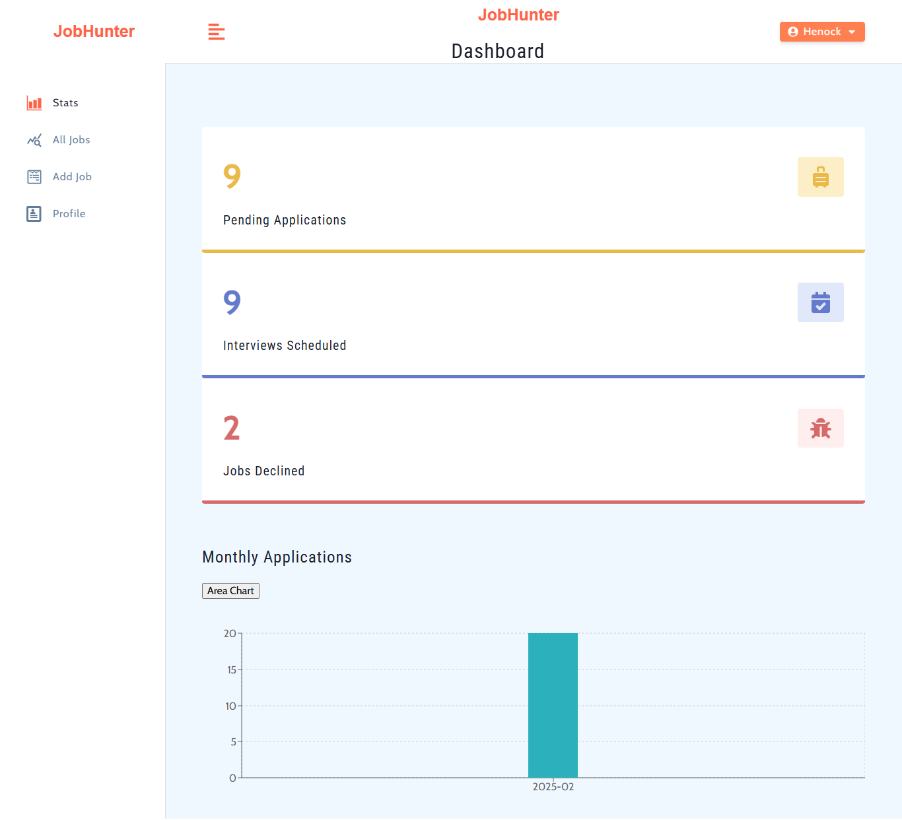
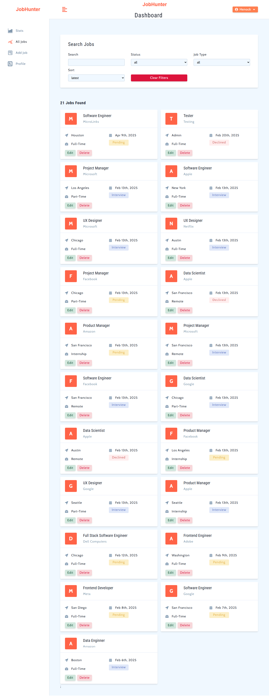

# Project Title: Job Hunter

## Overview

# JobHunter - Modern Stack Edition

A job tracking site built with Django/PostgreSQL backend and React Js frontend. Users can add, edit, delete and view job listings.

## Key Features

## Key Architecture Changes

- **Backend**: Django REST Framework with PostgreSQL database
- **Frontend**: React.js with Styled Components for UI components
- **API**: RESTful interface between frontend and backend
- **State Management**: React UseContext for global state management

## Screenshots



## About the Project

This is a full stack react js frontend and Django js and PostgreSQL Backend app for job seekers to to follow up status of job applications. The app has a full user authentication system using tokens with password reset functionality.

### Backend (Django + PostgreSQL)

- RESTful API endpoints for all operations
- Enhanced database models with PostgreSQL-specific features
- JWT authentication for secure API access using
- Optimized queries for better performance
- Django admin interface for content management

### Frontend (React)

- Single Page Application (SPA) architecture
- Responsive UI with modern design
- Client-side routing for seamless navigation
- Real-time updates for job stats

## Features

- **User Authentication**: Secure login/registration with JWT
- **Job tracking**: Create, view, update, and close job listings
- **Categories**: Browse listings by category
- **Admin Dashboard**: Full CRUD capabilities via Django admin

## Technology Stack

### Backend

- Python 3.10.2
- Django 5.1
- Django REST Framework
- PostgreSQL
- JWT Authentication
- Django CORS Headers

### Frontend

- React.js
- React Router
- Axios for API calls
- React useContext (state management)
- Styled Components for CSS

## Getting Started

### Prerequisites

- Node.js (v14+)
- Python 3.8+
- PostgreSQL (v12+)
- npm or yarn

### Installation

1. **Clone the repository**

   ```bash
   git clone https://github.com/Henoker/JobHunter

   ```

2. **Backend Setup**

   ```bash
   cd backend
   python -m venv venv
   venv\Scripts\activate
   pip install -r requirements.txt
   ```

# Set up PostgreSQL database and update settings.py

```bash
python manage.py migrate
python manage.py createsuperuser
python manage.py runserver
```

3. **Frontend Setup**

   ```bash
   cd frontend
   npm install
   npm run start
   ```

```


4. **Environment Variables**

- Create .env files for both backend and frontend with appropriate configuration (database URL, API endpoints, etc.)

## LICENSE

- MIT License

## Images


## Contact

- Henock Beyene Testfatsion - [hennybany@gmail.com](mailto:hennybany@gmail.com)
- Project link: https://github.com/Henoker/JobHunter

## Contributing

- Henock Beyene Tesfatsion - [hennybany@gmail.com](mailto:hennybany@gmail.com)

## Love my effort?

<a href='https://www.linkedin.com/in/henock-beyene-tesfatsion-921ba54b/' target='_blank'>
```
